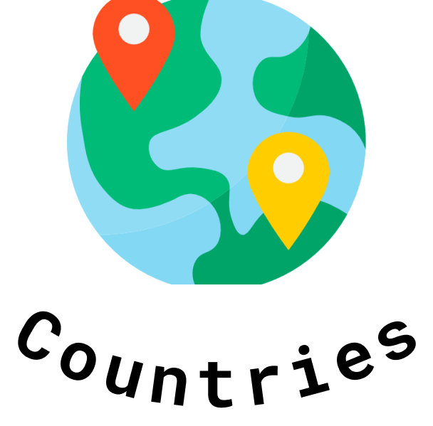

<p align="center">
    
</p>

<p align="center"> 
It's a simple package to help does handler with countries in [Dart] language and [Flutter] Framework.
</p>

## Usage

### Countries class

Can access all countries saved and methods to use them.

It's one of most important class in the package.

```dart
print(Countries.brazil) /// Country(Brazil, BR, +55, Continent.southAmerica)
```

#### Methods

`toList` - makes a country `List` of all countries saved;

`getByAlpha2` get a country by country `alpha2` code;

`getDialingCode` get a country by country `dialing code`;

`getByContinent` - get countries by `continent`;

`getByName` - get a country by country `name`;


